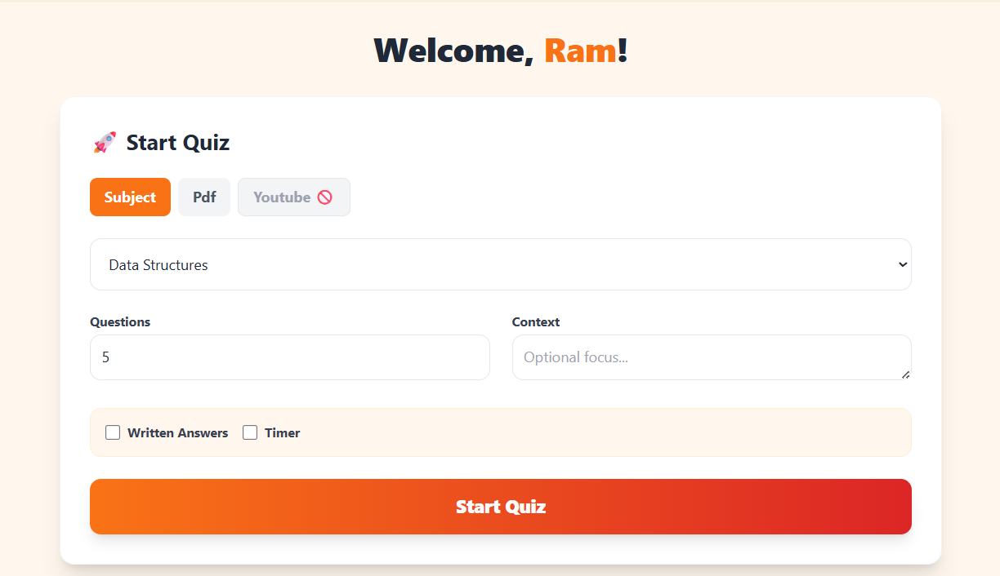
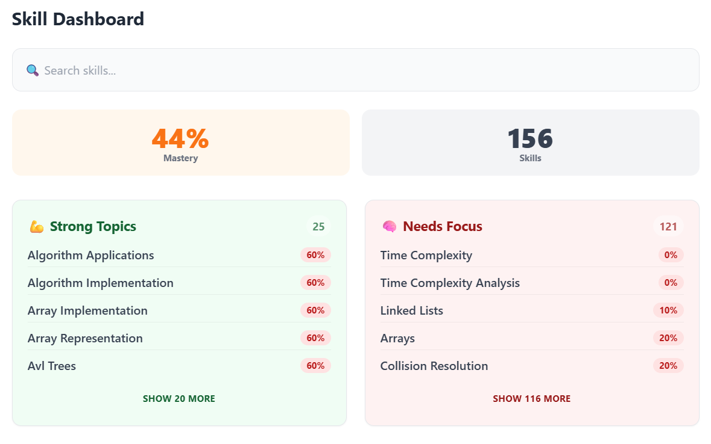
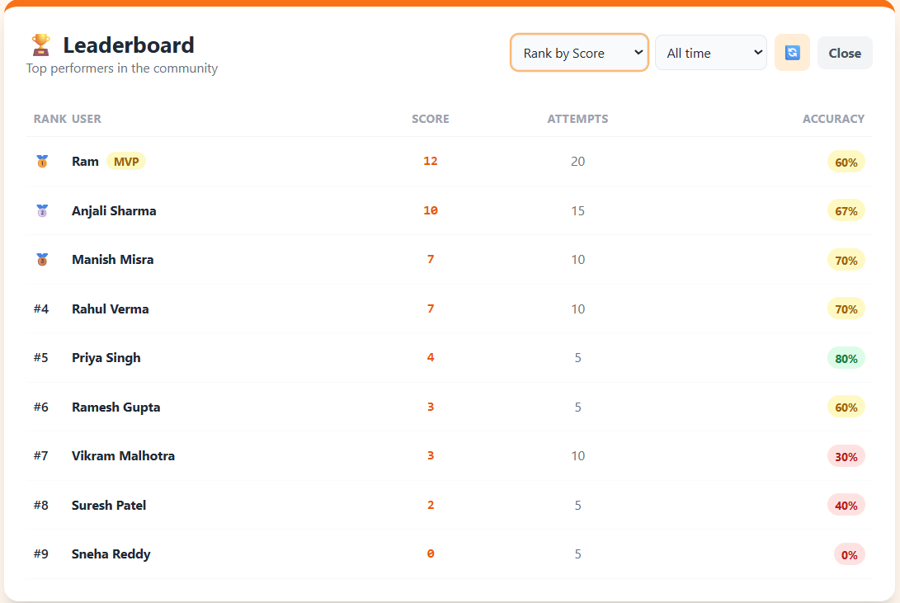
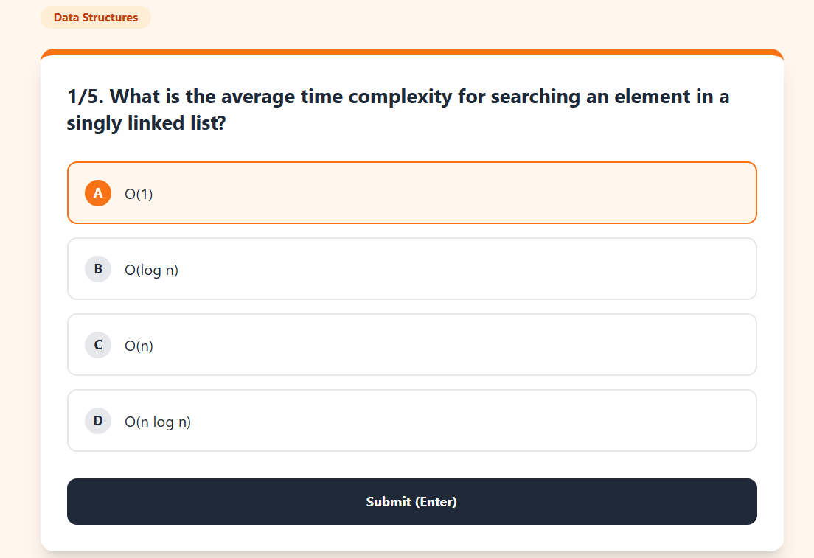
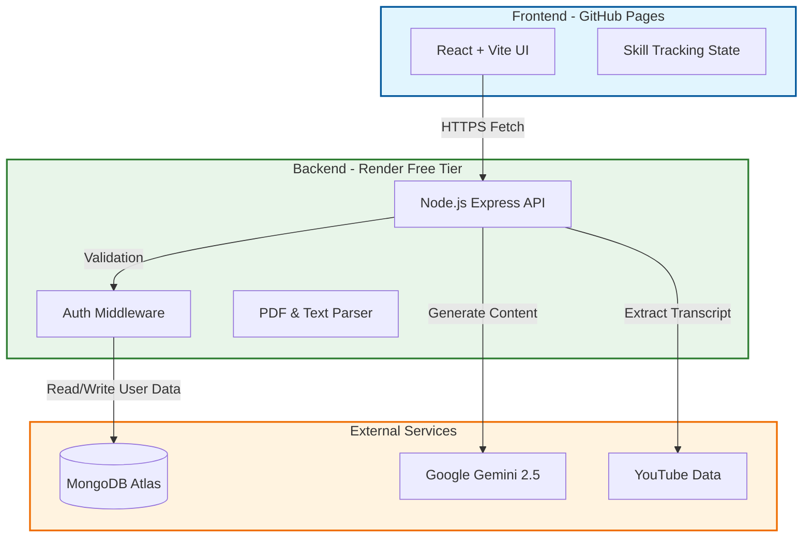

# Smart Quiz Master 🧠

## An AI-Powered Full-Stack EdTech Platform for Students 🚀

## [Live Demo Link](https://appledinger.github.io/smart_quiz_master_mvp/) 🔗

<div align="center">
  <br>
</div>

<br/>
<br/>

---

<br/>

## Project Overview 🏆 

**Smart Quiz Master** leverages the power of **Google Gemini 2.5 AI** to transform any study material—be it PDF notes, YouTube videos, or abstract topics—into interactive gamified quizzes. It features real-time skill tracking, a global leaderboard, and a persistent database to help students master their subjects.

<br/>

----

<br/>

## Features

- ### **AI-Powered Generation 🤖**
- ### **PDF & Document Analysis 📄**
- ### **Global Leaderboard System 🏆**
- ### **Real-Time Skill Tracking 📊**
- ### **Responsive & Mobile Friendly 📱**
- ### **Secure Backend Architecture 🔐**
- ### **YouTube Transcript Parsing 📺**

<br/>

<div align="center">




</div>

<br/>
<br/>

## Test the live deployment on GitHub Pages 🚀

## [Live App Link](https://appledinger.github.io/smart_quiz_master_mvp/) 🔗

<div align="center">

  <br>
</div>

<br/>

----

<br/>

## Technologies Used 🛠️

- **React.js (Vite)** ⚛️
- **Node.js & Express** 🟢
- **MongoDB Atlas** 🍃
- **Google Gemini AI** ✨
- **Tailwind CSS** 🎨

---

<br/>

## How To Use (Local Setup) 🔧

From your command line, first clone the repository:

```bash
# Clone this repository
$ git clone [https://github.com/AppleDinger/smart_quiz_master_mvp.git](https://github.com/AppleDinger/smart_quiz_master_mvp.git)

# Go into the repository
$ cd smart_quiz_master_mvp


Step 1: Setup Backend
You need to set up the server first to handle AI requests and Database connections.

```bash
# Go into backend folder
$ cd backend

# Install dependencies
$ npm install

# Create environment file (Windows)
$ type nul > .env
```
Open the .env file and add your keys:
```in env file
PORT=4000
GEMINI_API_KEY=your_api_key
MONGO_URI=your_mongodb_connection_string
```
Then start the server:

```bash
# Run the server
$ node server.js
```
Step 2: Setup Frontend
Open a new terminal window and set up the React client.
```bash
# Go into frontend folder
$ cd smart-quiz-mvp

# Install dependencies
$ npm install

# Run the app
$ npm run dev
```
Once you run npm run dev, open the local link (usually http://localhost:5173) in your browser.

----

##Architecture Overview
###The Split-Hosting Strategy ☁️
This app uses a modern Split-Hosting architecture to ensure security and performance on the free tier.

## Architecture Overview

### The Split-Hosting Strategy ☁️

This app uses a modern **Split-Hosting** architecture to ensure security and performance on the free tier.



Frontend: Hosted on GitHub Pages. It handles the UI, State Management, and PDF generation.

Backend: Hosted on Render. It protects the API Keys, handles OCR processing, and talks to the AI.

Database: Hosted on MongoDB Atlas. It permanently stores user profiles, quiz history, and skill statistics.

----
Author 👨‍💻
Ram Mishra - Linkedin, Github

Note:
I'm currently looking for Software Engineering Opportunities or Internships. If you like this project, feel free to reach out to me via LinkedIn! 🙌
